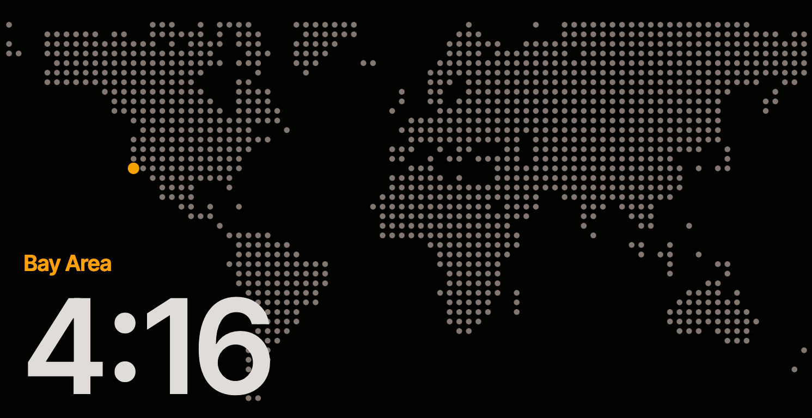

# Apple StandBy Worldmap Time

Create a HTML page with a dotted world map, your location highlighted and the current time. Like the Standby Clock on iOS devices.



## Worldmap Creation

* Edit `create.js` file
* Run node.js script:
```bash
npm install
node create.js
```
* open `index.html`

## Feature

* 12-hours format

## ToDo

* Settings 
* Settings via URL params

## Acknowledgment
* 2024-11-14 Forked from `https://github.com/the-sz/Apple-StandBy-Clock-Worldmap`
* The worldmap is created with https://github.com/NTag/dotted-map/tree/main
